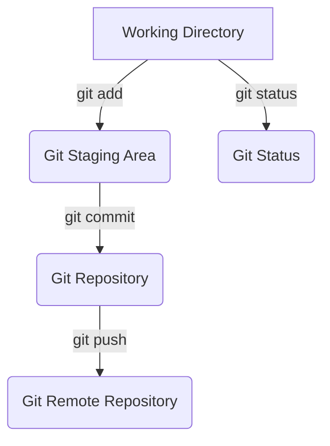

<h1>Notes<h1>

<h2> Task 1 <h2>
When using git add "filename" it stages the file for commit, can also use git add . to stage all files

When using git status it stages files to be commited, with the ability to unstage them by using git restore --staged file

