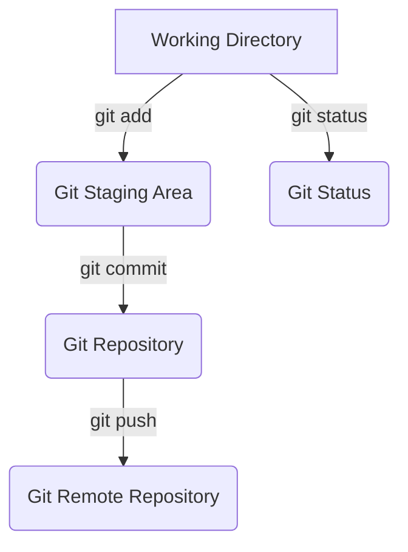

# Notes

## Task 
When using git add "filename" it stages the file for commit, can also use git add . to stage all files

When using git status it stages files to be commited, with the ability to unstage them by using git restore --staged file

When useing git push it requires that i use "git push --set-upstream origin toolbox" as i currently dont have a branch named toolbox on remote

after which i use git status is says "nothing to commit, working tree clean"

## Task 2 
**Give a description of software lifecycle and different techniques for adhering to the lifecycle.**