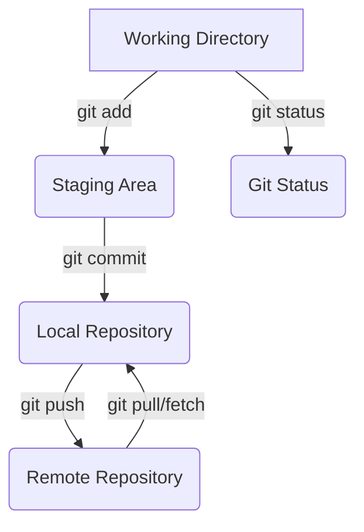

# Notes

## Task 
When using git add "filename" it stages the file for commit, can also use git add . to stage all files  

When using git status it stages files to be commited, with the ability to unstage them by using git restore --staged file  

When useing git push it requires that i use "git push --set-upstream origin toolbox" as i currently dont have a branch named toolbox on remote

after which i use git status is says "nothing to commit, working tree clean"

## Task 2 
**Part 1 - Give a description of software lifecycle and different techniques for adhering to the lifecycle.**  

1. **Planing** The software lifecycle, starts with finding the requirements for the system. 

2. **Design** Design the structure and behavior of the system, by using UML diagrams, design patterns and wireframes ect. Ie. Class diagram...

3. **Impementation** Write the code based on the diagrams

4. **Evaluation** Test the code and system, and squash the bugs

**Part 2 - Outline and explan five common practices for teachnics and method when developing applications**

